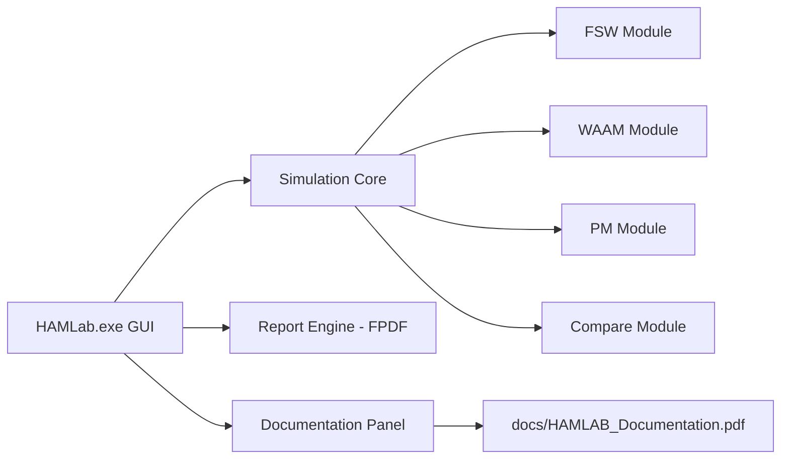

# HAM Lab Controller


HAM Lab Controller is a desktop engineering application for process planning, simulation, and reporting in high-sensitivity manufacturing workflows.

It provides a unified interface for:
- FSW process simulation
- WAAM energy and deposition planning
- PM consolidation analysis
- Cross-process comparative studies
- PDF report generation
- In-app documentation access

## Why This Project

This software is designed for technical and operational decisions where model outputs can affect process parameters, planning strategy, and documentation quality. Because it may involve sensitive project information, this repository is distributed as proprietary software.

## Features

- Multi-panel simulation cockpit (FSW, WAAM, PM, Compare)
- Layer-wise calculations and plotted process trends
- Structured PDF export workflows
- Built-in documentation launcher
- GitHub release update detection with one-click installer launch
- Windows installer generation for easy deployment

## System Architecture



## Project Structure

- `hamlab.py`: Stable launcher entrypoint
- `hamlab_v2_3.py`: Main application UI + simulation logic
- `docs/HAMLAB_Documentation.pdf`: Bundled technical documentation
- `requirements.txt`: Python dependency list
- `build_installer.bat`: Builds app package and installer
- `installer/HAMLAB_Setup.iss`: Inno Setup script

## Local Development

### 1. Create Environment and Install Dependencies

```powershell
python -m venv .venv
.\.venv\Scripts\Activate.ps1
pip install -r requirements.txt
```

### 2. Run Application

```powershell
python hamlab.py
```

## Build Distribution

Run the complete build pipeline:

```powershell
.\build_installer.bat
```

This performs:
1. Dependency sync.
2. PyInstaller build for `dist/HAMLab/HAMLab.exe`.
3. Documentation file packaging.
4. Inno Setup compile for `dist/installer/HAMLab_Setup_v2_3.exe`.

## Deliverables

- App executable folder build:
	- `dist/HAMLab/HAMLab.exe`
- Shareable installer executable:
	- `dist/installer/HAMLab_Setup_v2_3.exe`

## In-App Update Flow

The app checks GitHub for the latest release and shows update status in the top bar.

How it works:
1. App queries the latest release from `anshubhawsar/Hamlab_controller`.
2. If release tag is newer than current app version, it enables `Install Update`.
3. Clicking `Install Update` downloads the latest setup `.exe` and launches installer.

Important:
- Publish updates using GitHub Releases (with a version tag like `v2.4`).
- Attach the installer `.exe` asset (setup/installer name ending with `.exe`).
- If no release installer asset exists, app cannot auto-install update.

## Publishing to GitHub

Standard release flow:
1. Update version constant in `hamlab_v2_3.py`.
2. Rebuild using `build_installer.bat`.
3. Commit source changes.
4. Create a tag and GitHub release.
5. Upload installer artifact from `dist/installer`.

## Security and Data Sensitivity

This project can be used in engineering contexts with sensitive process information.

Recommended practices:
- Do not commit confidential data or customer datasets.
- Use private repositories for internal variants.
- Restrict installer distribution to authorized recipients.
- Apply code-signing certificates for production deployment.

## Legal and Copyright

Copyright (c) 2026 HAM Lab Engineering. All rights reserved.

This repository is proprietary and confidential. Unauthorized copying, modification, reverse engineering, redistribution, or use is prohibited except with prior written permission.

See:
- `LICENSE`
- `COPYRIGHT.md`
